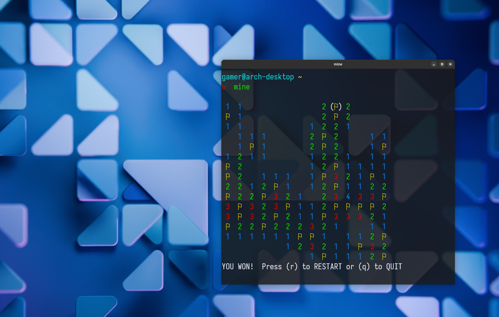

# CLI Minesweeper written in Ada



## Compile and Run (Linux)
To compile you'll need the gnat compiler and toolchain, as well as make. The oldest compatible language version is Ada 2012.
```shell
sudo apt install gnat
git clone https://github.com/ImFstAsFckBoi/Ada-Minesweeper
cd Ada-Minesweeper
make
./mine
```

## Install

### Arch / pacman
Download automatically
```shell
curl -fsSL -o PKGBUILD https://raw.githubusercontent.com/ImFstAsFckBoi/Ada-Minesweeper/master/PKGBUILD-GIT && makepkg -si
```
Manually
```shell
git clone https://github.com/ImFstAsFckBoi/Ada-Minesweeper
cd Ada-Minesweeper
makepkg -si
```
### Other Linux
```shell
git clone https://github.com/ImFstAsFckBoi/Ada-Minesweeper
cd Ada-Minesweeper
make install
```

## Customize!
The file [prep.def](src/prep.def) can be used to customize some of the parameters the program is compiled with. After editing you must rerun `make` to see the changes. You can change cursor style, board size, etc. The file follows standard Ada syntax. Example:
```shell
VARIABLE := VALUE
BOARD_WIDTH := 10
CURSOR_RIGHT := "{"
```


## Controls
<table>
    <tr>
        <th>
            <kbd>w</kbd>, <kbd>a</kbd>, <kbd>s</kbd>, <kbd>d</kbd>
            or
            <kbd>⬆️</kbd>, <kbd>⬇️</kbd>, <kbd>⬅️</kbd>, <kbd>➡️</kbd>
        </th>
        <th>Move cursor</th>
    </tr>
     <tr>
        <th><kbd>SPACE</kbd></th>
        <th>Open cell</th>
    </tr>
     <tr>
        <th><kbd>f</kbd></th>
        <th>Flag cell</th>
    </tr>
     <tr>
        <th><kbd>q</kbd></th>
        <th>Quit</th>
    </tr>
</table>
